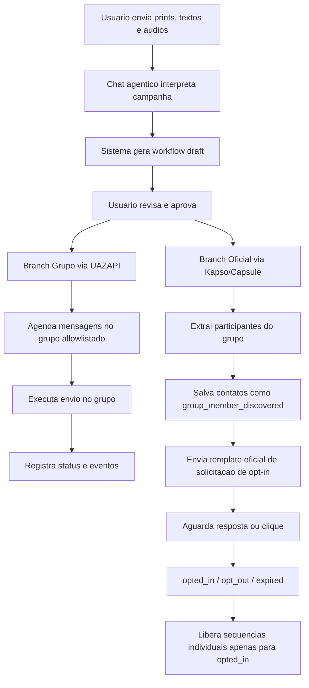

# PRD - WhatsApp Campaign Engine

## 1. Resumo

Construir uma plataforma para criar, revisar, aprovar e executar fluxos de comunicacao para leads captados em grupos de WhatsApp.

O sistema tera duas branches operacionais:

- **Branch de grupo:** envio de comunicacoes programadas dentro de um grupo allowlistado via UAZAPI/WhatsApp pessoal.
- **Branch oficial 1:1:** extracao dos participantes do grupo, cadastro no banco como contatos descobertos e envio individual via provider oficial Meta, com primeiro template dedicado a solicitar autorizacao/opt-in.

O sistema tambem deve aceitar audios enviados pelo usuario, transcrever o conteudo e transformar essas instrucoes em insumos revisaveis para criacao do workflow.

O objetivo e reduzir esquecimento operacional, eliminar dependencia de execucao manual do time, dar visibilidade sobre os textos enviados e manter controle de risco por etapa.

## 2. Problema

Hoje a sequencia de comunicacao depende de ferramentas com muita burocracia operacional e baixa visibilidade sobre:

- quais mensagens foram programadas;
- quais instrucoes foram passadas por texto, print ou audio;
- quais templates estao aprovados;
- qual etapa cada lead/grupo esta recebendo;
- se os envios aconteceram no horario correto;
- se houve falha, atraso, desconexao ou erro de provider;
- se o contato possui consentimento para mensagens individuais.

Isso cria risco de esquecimento, retrabalho, falta de padronizacao e perda de oportunidade comercial.

## 3. Objetivos

- Permitir que o usuario envie prints/textos do fluxo desejado.
- Permitir que o usuario envie audios com instrucoes do fluxo desejado.
- Transcrever e interpretar audios enviados pelo usuario.
- Gerar um workflow draft com mensagens, horarios, canais e dependencias.
- Permitir revisao humana antes de qualquer execucao.
- Programar mensagens no grupo via UAZAPI.
- Extrair participantes do grupo allowlistado.
- Salvar contatos extraidos como `group_member_discovered`.
- Enviar template oficial individual solicitando opt-in.
- Registrar prova de consentimento.
- Liberar sequencias individuais apenas para contatos `opted_in`.
- Exibir timeline operacional de campanhas, grupos, contatos, envios e falhas.

## 4. Nao Objetivos Do MVP

- Nao construir canvas visual completo estilo ManyChat no MVP.
- Nao fazer disparo comercial 1:1 para contatos sem opt-in.
- Nao enviar mensagens para grupos nao allowlistados.
- Nao automatizar criacao de novos grupos.
- Nao usar token administrativo da UAZAPI no worker de envio.
- Nao executar campanha sem aprovacao humana.
- Nao substituir CRM completo no MVP.

## 5. Personas

### Owner / Usuario principal

Quer desenhar a campanha, validar textos, aprovar templates, acompanhar execucao e reduzir dependencia operacional do time.

### Operador

Pode revisar campanhas, acompanhar falhas, pausar execucao e validar status de templates.

### Sistema agentico

Interpreta prints, textos e audios, sugere workflow, organiza mensagens e prepara payloads, mas nao executa acoes irreversiveis sem aprovacao.

## 6. Fluxo Geral



## 7. Branch De Grupo

### Descricao

Usa a UAZAPI para enviar comunicacoes programadas dentro do grupo de captacao onde os leads estao presentes.

### Grupo MVP

Grupo operacional: `+4x lead, -68% de custo comercial`.

### Regras

- Apenas grupos allowlistados podem receber mensagens.
- O grupo MVP e o unico permitido inicialmente.
- A instancia precisa estar conectada.
- O usuario precisa aprovar a campanha antes do agendamento.
- O sistema deve bloquear envio se a instancia estiver desconectada.
- O sistema deve registrar cada envio, payload, resposta do provider e status.
- Nao deve haver envio concorrente em massa pelo canal de grupo.

### Requisitos Funcionais

- Listar status da instancia UAZAPI.
- Exibir grupo allowlistado.
- Permitir programar mensagens por data/hora.
- Permitir pausar/cancelar jobs futuros.
- Registrar envio realizado.
- Registrar falha e motivo.
- Exibir timeline do grupo.

## 8. Branch Oficial 1:1

### Descricao

Usa provider oficial Meta via Kapso/Capsule para enviar templates individuais aos contatos extraidos automaticamente do grupo.

O primeiro template deve pedir autorizacao para envio de novas mensagens.

### Estados De Consentimento

```txt
unknown
group_member_discovered
consent_request_candidate
opt_in_requested
opted_in
opt_out
expired
blocked
```

### Regras

- Participante extraido do grupo nao e opt-in automatico.
- Contato extraido entra como `group_member_discovered`.
- O primeiro envio oficial permitido e apenas template de solicitacao de opt-in.
- Sem follow-up comercial antes da confirmacao.
- Sem retry automatico para quem nao responde.
- Resposta negativa vira `opt_out`.
- Resposta afirmativa ou clique rastreado vira `opted_in`.
- O sistema deve guardar prova do consentimento.

### Requisitos Funcionais

- Extrair participantes do grupo allowlistado.
- Normalizar telefone em formato E.164.
- Deduplicar contatos.
- Cruzar com leads existentes.
- Criar ou atualizar contato no banco.
- Enviar template oficial de opt-in.
- Registrar provider message id.
- Processar resposta/clique.
- Atualizar status de consentimento.
- Liberar sequencias individuais apenas para `opted_in`.

## 9. Chat Agentico

### Objetivo

Permitir que o usuario envie prints, textos, audios e instrucoes para o sistema transformar em workflow draft.

### Requisitos

- Aceitar upload de imagens.
- Aceitar upload de audios.
- Aceitar lista de textos por template/mensagem.
- Transcrever audios enviados pelo usuario.
- Identificar se o audio contem instrucao operacional, texto de template, regra de horario, alteracao de fluxo ou observacao geral.
- Separar conteudo transcrito em blocos revisaveis.
- Permitir que o usuario edite a transcricao antes de gerar o workflow.
- Marcar quais etapas do workflow foram inferidas a partir de audio.
- Identificar horarios, ordem, canais e dependencias.
- Gerar workflow estruturado.
- Apontar ambiguidades antes de aprovar.
- Exibir preview dos textos.
- Nunca ativar campanha sem confirmacao humana.

### Tratamento De Audio

Estados do processamento:

```txt
uploaded
transcribing
transcribed
needs_review
approved_for_workflow
rejected
```

Regras:

- Audio nunca pode gerar campanha ativa diretamente.
- Toda transcricao precisa ser revisavel antes de virar workflow.
- Se a confianca da transcricao for baixa, o sistema deve pedir revisao.
- Se houver horarios ambiguos, o sistema deve pedir confirmacao.
- Se o audio trouxer texto de template, o sistema deve preservar a versao transcrita e a versao editada.
- Se o audio contradisser texto/print enviado, o sistema deve destacar conflito.
- A timeline da campanha deve indicar quando uma decisao ou etapa foi inferida a partir de audio.

## 10. Approval Console

### Requisitos

- Aprovar workflow.
- Rejeitar workflow.
- Editar mensagem antes da aprovacao.
- Aprovar envio para grupo.
- Aprovar submissao de template oficial.
- Aprovar inicio da campanha.
- Pausar campanha em andamento.
- Exibir historico de aprovacoes.

## 11. Dashboard Operacional

### Requisitos

- Listar campanhas.
- Mostrar estado da campanha.
- Mostrar proximos envios.
- Mostrar envios realizados.
- Mostrar falhas por provider.
- Mostrar status da instancia UAZAPI.
- Mostrar status dos templates oficiais.
- Mostrar contatos por estado de consentimento.
- Mostrar timeline por campanha, grupo e contato.

## 12. Templates

### Template De Opt-In

O primeiro template individual deve ser claro, curto e orientado a autorizacao.

Exemplo conceitual:

```txt
Oi, {{nome}}. Voce esta no grupo {{grupo}}.
Posso te enviar por aqui os proximos materiais e avisos relacionados a essa mentoria?
Responda SIM para autorizar ou NAO para nao receber.
```

### Regras

- Template precisa ser aprovado pelo provider oficial.
- Template de opt-in nao deve parecer uma oferta comercial completa.
- Deve conter mecanismo claro de nao autorizacao.
- Mudancas relevantes criam nova versao.

## 13. Dados

### Entidades Principais

- Campaign
- CampaignVersion
- WorkflowDefinition
- WorkflowStep
- TemplateDraft
- TemplateVersion
- ChannelAccount
- Contact
- ContactConsent
- GroupTarget
- GroupContactExtraction
- UserAudioInstruction
- AudioTranscript
- ScheduledJob
- SendAttempt
- MessageEvent
- WebhookEvent
- Approval
- OptOut

### Prova De Consentimento

Cada consentimento deve guardar:

- contato;
- telefone;
- origem;
- grupo de origem;
- template enviado;
- data/hora do pedido;
- resposta ou clique;
- data/hora da confirmacao;
- provider message id;
- payload de prova.

### Audio Do Usuario

Cada audio enviado pelo usuario deve guardar:

- arquivo original;
- duracao;
- idioma detectado;
- transcricao bruta;
- transcricao revisada;
- confianca da transcricao;
- classificacao do conteudo;
- vinculo com campanha/workflow;
- usuario que enviou;
- data/hora do envio;
- status de processamento.

## 14. Risk Engine

O sistema deve avaliar toda tentativa de envio antes do provider.

### Bloqueios Obrigatorios

- campanha nao aprovada;
- provider desconectado;
- grupo fora da allowlist;
- contato opt-out;
- template nao aprovado;
- contato sem opt-in tentando receber mensagem comercial;
- contato `group_member_discovered` tentando receber algo diferente do template de opt-in;
- tentativa duplicada com mesma idempotency key.

## 15. Metricas

- contatos extraidos;
- contatos deduplicados;
- templates de opt-in enviados;
- taxa de opt-in;
- taxa de opt-out;
- templates aprovados;
- mensagens no grupo enviadas;
- audios enviados pelo usuario;
- audios transcritos com sucesso;
- audios que exigiram revisao;
- etapas de workflow geradas a partir de audio;
- falhas por provider;
- campanhas pausadas;
- tempo medio ate aprovacao de template;
- tempo medio ate opt-in.

## 16. Requisitos Nao Funcionais

- Logs auditaveis.
- Idempotencia em todo envio.
- Segredos fora do banco e fora do codigo.
- Tokens nunca aparecem no frontend.
- Webhooks com segredo/assinatura.
- Kill switch global.
- Kill switch por canal.
- Retentativas limitadas.
- Painel deve refletir eventos quase em tempo real.

## 17. Criterios De Aceite Do MVP

1. Usuario consegue criar campanha a partir de textos/prints.
2. Usuario consegue enviar audio com instrucoes da campanha.
3. Sistema transcreve audio e permite revisao.
4. Sistema identifica instrucoes, horarios e textos presentes no audio.
5. Sistema gera workflow draft revisavel.
6. Usuario aprova campanha.
7. Sistema agenda mensagem no grupo allowlistado.
8. Sistema envia mensagem no grupo e registra status.
9. Sistema extrai contatos do grupo allowlistado.
10. Sistema salva contatos como `group_member_discovered`.
11. Sistema deduplica contatos.
12. Sistema envia template oficial de solicitacao de opt-in.
13. Sistema registra resposta positiva como `opted_in`.
14. Sistema registra resposta negativa como `opt_out`.
15. Sistema bloqueia mensagem comercial para quem nao confirmou opt-in.
16. Dashboard mostra campanha, grupo, contatos, envios e falhas.

## 18. Roadmap

### Fase 1 - Fundacao

- Banco de dados.
- Entidades principais.
- Risk engine.
- Adapters UAZAPI e Kapso/Capsule.
- Dashboard basico.

### Fase 2 - Grupo

- Status da instancia.
- Grupo allowlistado.
- Agenda de mensagens.
- Envio programado.
- Timeline de grupo.

### Fase 3 - Extracao E Consentimento

- Extracao de participantes.
- Normalizacao e dedupe.
- Consent request.
- Webhook/resposta.
- Estados de opt-in.

### Fase 4 - Chat Agentico

- Upload de prints.
- Upload de audios.
- Transcricao de audios.
- Interpretacao de fluxo.
- Workflow draft.
- Approval console.

### Fase 5 - Operacao

- Alertas.
- Relatorios.
- Controles avancados.
- Canvas visual futuro.

## 19. Riscos

- Uso de UAZAPI e nao oficial e pode sofrer instabilidade.
- Instancia pessoal pode desconectar.
- Grupo em modo anuncio exige permissao de admin.
- Templates oficiais podem ser rejeitados.
- Envio de opt-in pode gerar feedback negativo se o texto for agressivo.
- Falta de prova de consentimento pode comprometer o canal oficial.

## 20. Decisao Principal

O sistema deve tratar providers como executores, nao como fonte da regra de negocio.

O backend decide:

- quem pode receber;
- quando pode receber;
- por qual canal;
- com qual template;
- em qual estado de consentimento;
- com qual prova registrada.

## 21. Plano De Producao Do MVP

### Objetivo

Transformar o PRD e o TDD em uma sequencia de implementacao que entregue valor rapido sem perder controle tecnico.

### Ordem Recomendada

1. **Foundation**
   - Definir stack final.
   - Criar projeto backend/frontend.
   - Configurar banco.
   - Configurar fila/scheduler.
   - Criar estrutura hexagonal.
   - Configurar secrets por ambiente.

2. **Dominio E Banco**
   - Criar entidades principais.
   - Criar tabelas de campanhas, grupos, contatos, consentimentos, envios e eventos.
   - Implementar idempotencia.
   - Implementar risk engine inicial.

3. **Adapter UAZAPI**
   - Status da instancia.
   - Grupo allowlistado.
   - Extracao de participantes.
   - Envio programado no grupo.
   - Logs de request/response.

4. **Adapter Oficial Kapso/Capsule**
   - Listar templates.
   - Submeter template de opt-in.
   - Enviar template de opt-in.
   - Processar webhooks de mensagem/resposta.

5. **Consentimento**
   - Criar contatos `group_member_discovered`.
   - Deduplicar e normalizar telefone.
   - Enviar opt-in request.
   - Atualizar estados `opted_in`, `opt_out`, `expired`.
   - Bloquear mensagens comerciais sem opt-in.

6. **Frontend Operacional**
   - Dashboard de campanhas.
   - Status da instancia.
   - Grupo allowlistado.
   - Lista de contatos extraidos.
   - Timeline de envios.
   - Approval console basico.

7. **Chat Agentico**
   - Upload de prints.
   - Upload de audios.
   - Transcricao.
   - Interpretacao de fluxo.
   - Workflow draft.
   - Revisao humana.

### Primeiro Marco De Entrega

O primeiro marco deve provar que a arquitetura funciona de ponta a ponta:

```txt
Instancia UAZAPI conectada
-> grupo allowlistado validado
-> participantes extraidos
-> contatos salvos como group_member_discovered
-> template oficial de opt-in enviado para contato teste
-> resposta processada
-> consentimento atualizado
-> timeline exibida no dashboard
```

### Decisoes Tecnicas Antes Do Primeiro Commit

- Stack frontend.
- Stack backend.
- ORM.
- Banco de dados.
- Fila/scheduler.
- Storage de anexos/audios.
- Ambiente de staging.
- URL publica de webhooks.
- Provedor de transcricao de audio.
- Estrategia de deploy.

### Criterio Para Comecar Codigo

Podemos iniciar implementacao assim que as decisoes tecnicas acima estiverem definidas ou assumidas para o MVP.

## 22. Stack E Direcao De Front-End

### Stack Fechada Recomendada

```txt
Monorepo: Turborepo + pnpm
Frontend: Next.js App Router + TypeScript
UI: Tailwind CSS + shadcn/ui + lucide-react
Backend: NestJS + Fastify + TypeScript
Banco: PostgreSQL
ORM: Prisma
Fila/Scheduler: BullMQ + Redis
Storage: Supabase Storage ou Cloudflare R2
Auth: Supabase Auth
Realtime MVP: Server-Sent Events
Deploy Frontend: Vercel
Deploy Backend/Workers: Railway ou Fly.io
Transcricao: adapter plugavel com provider de speech-to-text
Providers: UAZAPI + Kapso/Capsule
```

### Direcao De Design

O front-end deve seguir uma direcao **Apple-grade**, inspirada em principios da Apple Human Interface Guidelines, sem copiar marca, componentes proprietarios ou identidade visual da Apple.

Principios:

- Clareza antes de densidade.
- Hierarquia visual calma e precisa.
- Poucas cores, usadas com intencao operacional.
- Estados muito claros: draft, aprovado, agendado, enviando, enviado, falhou, pausado.
- Microinteracoes discretas.
- Tipografia limpa, com excelente legibilidade.
- Espaçamento generoso, mas sem cara de landing page.
- Painel operacional sofisticado, nao marketing page.
- Componentes previsiveis e consistentes.
- Acoes destrutivas sempre explicitas.
- Feedback imediato para upload, transcricao, aprovacao, envio e falha.
- Timeline como elemento central da experiencia.

### Telas Prioritarias Do Front-End

1. **Command Center**
   - Visao geral das campanhas.
   - Status da instancia UAZAPI.
   - Status dos templates oficiais.
   - Proximos envios.
   - Alertas operacionais.

2. **Campaign Builder**
   - Chat agentico.
   - Upload de prints.
   - Upload de audios.
   - Transcricao revisavel.
   - Workflow draft.
   - Preview de mensagens.

3. **Approval Console**
   - Aprovar workflow.
   - Aprovar template.
   - Aprovar envio.
   - Pausar campanha.
   - Ver conflitos e ambiguidades.

4. **Group Operations**
   - Grupo allowlistado.
   - Agenda de mensagens.
   - Historico de envios no grupo.
   - Estado da instancia.

5. **Consent Inbox**
   - Contatos extraidos.
   - Estado de consentimento.
   - Template de opt-in enviado.
   - Respostas positivas/negativas.
   - Prova de consentimento.

6. **Timeline**
   - Eventos por campanha, grupo e contato.
   - Origem da decisao: print, texto, audio, template ou webhook.
   - Log resumido de cada acao.

### Regras Visuais

- Nao usar hero marketing no app.
- Nao usar cards decorativos em excesso.
- Evitar gradientes chamativos.
- Evitar interface monocromatica sem contraste operacional.
- Usar icones apenas quando ajudam acao ou leitura.
- Priorizar tabelas, timelines, listas e paineis escaneaveis.
- Cada tela deve ter uma acao primaria clara.
- Nunca esconder status critico em texto pequeno.
- Textos de botoes devem ser curtos e orientados a acao.

### Qualidade Esperada

O usuario deve sentir que esta operando um cockpit preciso, nao preenchendo formularios soltos.

A experiencia deve transmitir:

- controle;
- calma;
- confianca;
- rastreabilidade;
- premium operacional;
- baixa carga cognitiva.
