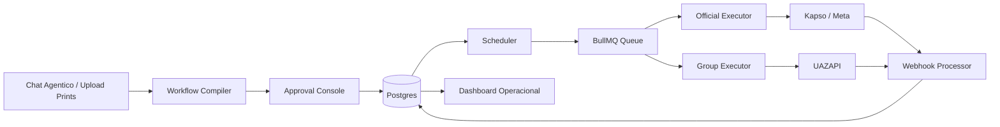

# Technical Design Doc - WhatsApp Campaign Engine

## 1. Objetivo

Construir um sistema para transformar prints, textos e instrucoes de campanha em fluxos executaveis de disparo, com validacao humana, auditoria completa e dois canais separados:

- **Canal oficial:** Kapso + Meta WhatsApp Business Platform para leads 1:1, templates aprovados, webhooks e status oficiais.
- **Canal de grupos:** UAZAPI para envio automatico em grupo via numero pessoal, assumindo risco controlado por ser API nao oficial.

O sistema deve permitir que o usuario envie referencias do fluxo, revise o workflow gerado, aprove templates/campanhas e acompanhe cada envio em tempo real.

## 2. Decisoes Principais

### 2.1 Arquitetura

Decisao: usar arquitetura hexagonal / Ports and Adapters no backend.

Motivo: o dominio do produto nao pode depender diretamente de Kapso, UAZAPI, Redis, Postgres ou qualquer fornecedor. Isso protege o sistema caso um provider mude, caia, seja substituido ou tenha limitacoes.

Camadas:

- **Domain:** campanhas, workflows, templates, agendamentos, aprovacoes, envios, auditoria, risk engine.
- **Application:** casos de uso, orquestracao, filas, execucao, processamento de eventos.
- **Ports:** interfaces abstratas para providers, storage, scheduler, media, webhooks e OCR/AI.
- **Adapters:** Kapso, UAZAPI, Postgres, BullMQ, S3/R2, OpenAI/vision, web controllers.

### 2.1.1 Stack Fechada Recomendada

```txt
Monorepo: Turborepo + pnpm
Frontend: Next.js App Router + TypeScript
UI: Tailwind CSS + shadcn/ui + lucide-react
Backend: NestJS + Fastify + TypeScript
Banco: PostgreSQL
ORM: Prisma
Fila/Scheduler: BullMQ + Redis
Storage: Supabase Storage ou Cloudflare R2
Auth: Supabase Auth
Realtime MVP: Server-Sent Events
Deploy Frontend: Vercel
Deploy Backend/Workers: Railway ou Fly.io
Transcricao: adapter plugavel com provider de speech-to-text
Providers: UAZAPI + Kapso/Capsule
```

Frontend:

- O front deve seguir uma direcao Apple-grade inspirada em principios da Apple Human Interface Guidelines.
- A interface deve ser original, sem copiar marca, componentes proprietarios ou identidade visual da Apple.
- Priorizar clareza, hierarquia, estados operacionais, microinteracoes discretas e baixa carga cognitiva.
- O app deve parecer um cockpit operacional premium, nao uma landing page.

### 2.2 Escopo do MVP

Decisao recomendada: MVP hibrido com Kapso oficial + UAZAPI grupos, mas com workflow gerado em draft e aprovacao humana obrigatoria.

Inclui:

- Upload de prints/textos.
- Chat agentico para interpretar campanha.
- Geracao de workflow draft em JSON canonico.
- Tela de aprovacao.
- Cadastro/submissao de templates via Kapso.
- Execucao oficial 1:1 via Kapso.
- Execucao de grupo via UAZAPI.
- Dashboard de status e timeline.

Nao inclui no MVP:

- Canvas visual completo estilo ManyChat.
- A/B testing.
- Multi-tenant sofisticado.
- Otimizacao automatica por performance.
- Edicao visual avancada de workflows.

### 2.3 Nivel de autonomia do agente

Decisao: agente nunca executa acao irreversivel sem aprovacao humana.

Permissoes por estagio:

- Pode interpretar prints e textos.
- Pode gerar draft de workflow.
- Pode sugerir nomes tecnicos de templates.
- Pode sugerir categoria do template.
- Pode gerar payload de template.
- Nao pode submeter template para Kapso sem aprovacao.
- Nao pode ativar campanha sem aprovacao.
- Nao pode enviar mensagens sem campanha aprovada.
- Nao pode alterar texto de template aprovado sem criar nova versao.

Estados:

```txt
draft -> reviewed -> templates_ready -> templates_submitted -> templates_approved -> scheduled -> running -> completed
```

### 2.4 Executor

Decisao: usar executor proprio com BullMQ no MVP; usar Kapso como transport/infrastructure provider.

Motivo: Kapso tem workflows nativos, mas manter o executor proprio garante:

- controle unificado entre Kapso e UAZAPI;
- mesma timeline para canais oficiais e grupos;
- risk engine central;
- retries controlados;
- idempotencia por envio;
- menor acoplamento com workflow nativo da Kapso.

Alternativa futura: delegar subfluxos oficiais para workflows nativos da Kapso quando o formato estiver maduro.

## 3. Arquitetura De Alto Nivel



## 4. Dominio

### 4.1 Entidades principais

```txt
Campaign
CampaignVersion
WorkflowDefinition
WorkflowStep
TemplateDraft
TemplateVersion
ChannelAccount
Lead
Contact
ContactConsent
GroupTarget
GroupContactExtraction
Enrollment
ScheduledJob
SendAttempt
MessageEvent
Approval
OptOut
RiskRule
WebhookEvent
MediaAsset
```

### 4.2 Agregados

- **Campaign Aggregate:** campanha, versao, workflow, aprovacoes.
- **Template Aggregate:** template draft, versoes, status Kapso/Meta, exemplos.
- **Delivery Aggregate:** agendamento, tentativas, eventos, comprovantes.
- **Contact Aggregate:** lead, opt-out, conversas, consentimento.
- **Group Aggregate:** grupo cadastrado, provider, status, politicas de envio.

## 5. Workflow Canonico

O workflow real do sistema deve ser JSON estruturado. O canvas, quando existir, sera apenas uma representacao visual desse JSON.

Exemplo:

```json
{
  "version": "1.0",
  "timezone": "America/Sao_Paulo",
  "campaign_id": "camp_123",
  "entry": "start",
  "nodes": [
    {
      "id": "start",
      "type": "start"
    },
    {
      "id": "msg_1",
      "type": "send_template",
      "channel": "kapso_official",
      "template_key": "call_segunda_msg_1",
      "parameters": {
        "first_name": "{{lead.first_name}}"
      }
    },
    {
      "id": "wait_1",
      "type": "wait_until",
      "at": "2026-06-08T11:35:00-03:00"
    },
    {
      "id": "group_msg_1",
      "type": "send_group_message",
      "channel": "uazapi_group",
      "group_key": "grupo_captacao_principal",
      "message_key": "grupo_lembrete_call_1"
    }
  ],
  "edges": [
    { "from": "start", "to": "msg_1" },
    { "from": "msg_1", "to": "wait_1" },
    { "from": "wait_1", "to": "group_msg_1" }
  ]
}
```

### 5.1 Tipos de node no MVP

```txt
start
send_template
send_text
send_group_message
wait_duration
wait_until
branch_on_reply
manual_review
stop
```

### 5.2 Tipos futuros

```txt
send_media
send_interactive
agent_step
webhook_call
function_call
handoff
ab_split
condition
```

## 6. Ports

### 6.1 Messaging Provider

```ts
export interface MessagingProvider {
  getHealth(accountId: string): Promise<ProviderHealth>;
  sendMessage(input: SendMessageInput): Promise<SendResult>;
  sendTemplate(input: SendTemplateInput): Promise<SendResult>;
  getMessage(messageId: string): Promise<MessageRecord | null>;
}
```

Adapters:

- `KapsoOfficialProvider`
- `UazapiGroupProvider`
- `ManualFallbackProvider`

### 6.2 Template Provider

```ts
export interface TemplateProvider {
  listTemplates(input: ListTemplatesInput): Promise<TemplateRecord[]>;
  submitTemplate(input: SubmitTemplateInput): Promise<TemplateSubmissionResult>;
  getTemplateStatus(input: TemplateStatusInput): Promise<TemplateStatus>;
}
```

Adapter:

- `KapsoTemplateProvider`

### 6.3 Group Provider

```ts
export interface GroupProvider {
  listGroups(accountId: string): Promise<GroupRemoteRecord[]>;
  sendGroupMessage(input: SendGroupMessageInput): Promise<SendResult>;
  getInstanceStatus(accountId: string): Promise<GroupInstanceStatus>;
}
```

Adapter:

- `UazapiGroupProvider`

### 6.4 Scheduler Port

```ts
export interface SchedulerPort {
  enqueue(job: ScheduledJobInput): Promise<ScheduledJobRef>;
  cancel(jobId: string): Promise<void>;
  reschedule(jobId: string, runAt: Date): Promise<void>;
}
```

Adapter:

- `BullMqScheduler`

## 7. Provider Strategy

### 7.1 Kapso

Uso:

- Criar e atualizar templates.
- Listar templates e status.
- Enviar mensagens oficiais 1:1.
- Ler conversas, mensagens e contatos.
- Receber webhooks oficiais.
- Monitorar saude de numeros.

Regras:

- Fora da janela de 24h, somente template aprovado.
- Mensagem livre so se houver janela de atendimento aberta.
- Erros como `131047` bloqueiam reenvio livre e sugerem template.
- Erros como `131042` bloqueiam campanha e disparam alerta financeiro/eligibilidade.

### 7.2 UAZAPI

Uso:

- Enviar mensagens para grupo cadastrado.
- Gerenciar sessao/instancia do numero pessoal.
- Receber eventos/webhooks, quando disponiveis.

Contratos validados em auditoria:

- API documentada como `uazapiGO - WhatsApp API`, versao `2.1.0`.
- Endpoints comuns usam header `token` com token da instancia.
- Endpoints administrativos usam header `admintoken`.
- O acesso administrativo lista instancias, mas nao deve ser usado pelo worker de envio.
- `/instance/status` valida se a instancia esta conectada.
- `/group/list` lista grupos da instancia.
- `/group/info` recebe `groupjid` e retorna detalhes do grupo.
- `/send/text` envia texto para telefone, usuario, canal ou grupo.
- `/send/media` envia midia para telefone, usuario, canal ou grupo.
- O campo `number` aceita JID de grupo no formato `@g.us`.
- `/webhook` configura webhooks por instancia.
- `/globalwebhook` existe na area administrativa, mas nao estava configurado na auditoria.

Instancia escolhida para MVP:

- Nome operacional: `Gabriel`.
- Secret esperado no runtime: `UAZAPI_GABRIEL_INSTANCE_TOKEN`.
- Estado atual validado: `connected`.
- Sessao conectada e apta para listagem de grupos.
- Perfil da instancia: numero pessoal, nao WhatsApp Business.
- Webhook atual da instancia existe, mas esta configurado apenas para evento `messages`.
- Listagem de grupos validada com sucesso.
- Total de grupos visiveis na instancia: 399.

Grupo allowlist do MVP:

- Nome: `+4x lead, -68% de custo comercial`.
- JID: `120363409578992998@g.us`.
- Estado: ativo, nao suspenso.
- Configuracao: grupo travado em modo anuncio/admin-only.
- Permissao validada: instancia `Gabriel` aparece como admin e pode enviar mensagens.

Extracao de participantes:

- A UAZAPI consegue retornar participantes do grupo via `/group/info`.
- Participantes extraidos do grupo nao devem ser considerados opt-in automatico.
- O sistema deve importar esses numeros como `group_member_discovered`.
- A primeira tentativa oficial 1:1 deve ser uma mensagem unica de solicitacao de autorizacao/opt-in, enviada via provider oficial.
- A mensagem inicial de opt-in nao pode conter oferta comercial agressiva, sequencia promocional ou promessa de continuidade sem confirmacao.
- O contato so muda para `opted_in` depois de resposta/acao afirmativa registrada.
- Enquanto estiver `opt_in_requested` ou `opt_in_pending`, o contato nao entra em sequencias comerciais.
- O risk engine deve bloquear qualquer template comercial para contatos com origem apenas `group_member_discovered`.
- Caminho mais conservador: mensagem no proprio grupo com CTA/link de cadastro, formulario ou click-to-WhatsApp para capturar opt-in antes do 1:1.

Branch oficial de solicitacao de opt-in:

```txt
group_member_discovered
-> dedupe_by_phone
-> normalize_phone
-> match_existing_lead
-> consent_request_candidate
-> send_official_opt_in_template
-> opt_in_requested
-> wait_for_reply_or_click
-> opted_in | opt_out | expired
```

Regras da branch:

- Um contato recebe no maximo uma solicitacao inicial de opt-in por campanha/origem.
- Sem retry automatico para quem nao responder.
- Sem follow-up comercial ate confirmacao.
- Respostas negativas ou termos de descadastro viram `opt_out`.
- Respostas afirmativas ou clique em link rastreado viram `opted_in`.
- Todo evento precisa gerar prova de consentimento: origem, horario, template, texto renderizado, resposta/clique e provider message id.

Regras:

- Apenas grupos explicitamente cadastrados.
- Apenas numero pessoal autorizado.
- Sem descoberta automatica de novos grupos no MVP.
- Sem envio concorrente.
- Pausar apos falhas consecutivas.
- Manter logs separados dos envios oficiais.
- Guardar no app apenas o token da instancia usada para envio, nao o token administrativo.
- Tratar `disconnected` como bloqueio de envio, nao como erro recuperavel imediato.
- Exigir reconexao manual/assistida antes de retomar jobs pausados por desconexao.
- Usar `track_source` e `track_id` nos envios quando disponivel para correlacionar eventos com `send_attempts`.

Pendencias antes de implementacao:

- Executar envio teste controlado no grupo allowlistado.
- Expandir webhook por instancia para eventos `connection`, `messages`, `messages_update`, `groups` e `sender`.
- Validar limites e comportamento em desconexao.

Payloads minimos:

```json
{
  "send_text": {
    "number": "120363000000000000@g.us",
    "text": "Mensagem programada",
    "delay": 1000,
    "track_source": "campaign_engine",
    "track_id": "send_attempt_id"
  },
  "group_info": {
    "groupjid": "120363000000000000@g.us",
    "force": false
  }
}
```

## 8. Risk Engine

Toda tentativa de envio passa por uma avaliacao antes de ir para o provider.

Checks minimos:

```txt
campaign.approved == true
channel.enabled == true
provider.health != unhealthy
message.version_locked == true
scheduled_at dentro da janela permitida
recipient/group ativo
opt_out inexistente
recipient.opt_in valido quando envio oficial 1:1 for business-initiated
rate_limit disponivel
template approved quando canal oficial fora da janela 24h
uazapi group allowlisted quando envio em grupo
contato com origem apenas group_member_discovered so pode receber template oficial de solicitacao de opt-in
contato com opt_in_pending nao pode receber template comercial
```

Resultado:

```txt
allow
block
needs_manual_review
```

## 9. Idempotencia E Reprocessamento

Cada envio deve ter uma chave idempotente:

```txt
campaign_id + enrollment_id/group_id + step_id + scheduled_at + message_version_id
```

Antes de enviar, o executor verifica se ja existe `SendAttempt` bem-sucedido com a mesma chave.

Retries:

- Kapso: retry apenas para falhas transientes.
- UAZAPI: retry limitado e com intervalo maior.
- Falhas de compliance, opt-out, template rejeitado ou billing nao geram retry automatico.

## 10. Banco De Dados

### 10.1 Tabelas iniciais

```txt
campaigns
campaign_versions
workflow_definitions
template_drafts
template_versions
channel_accounts
leads
contacts
contact_consents
group_targets
group_contact_extractions
campaign_enrollments
scheduled_jobs
send_attempts
message_events
approvals
opt_outs
webhook_events
media_assets
provider_health_checks
```

### 10.2 Campos criticos em send_attempts

```txt
id
idempotency_key
campaign_id
workflow_step_id
channel
provider
recipient_type
recipient_id
scheduled_at
started_at
completed_at
status
provider_message_id
rendered_text
request_payload_json
response_payload_json
error_code
error_message
proof_media_asset_id
created_at
updated_at
```

### 10.3 Campos criticos em contact_consents

```txt
id
contact_id
phone_e164
status
source
source_group_jid
source_group_name
requested_at
confirmed_at
declined_at
expired_at
request_template_id
request_provider_message_id
confirmation_event_id
proof_payload_json
created_at
updated_at
```

Estados de consentimento:

```txt
unknown
group_member_discovered
consent_request_candidate
opt_in_requested
opted_in
opt_out
expired
blocked
```

## 11. Frontend

Areas principais:

- **Chat Agentico:** upload de prints, textos, instrucoes, anexos.
- **Workflow Review:** ordem dos passos, horarios, mensagens e canais.
- **Template Review:** texto, variaveis, categoria, exemplos e status.
- **Approval Console:** aprovar template, aprovar campanha, pausar, rejeitar.
- **Dashboard:** campanhas, jobs, envios, falhas, leitura, respostas.
- **Grupo:** agenda de mensagens em grupo, status da instancia, historico.
- **Timeline:** visao por lead/grupo/campanha.

## 12. Webhooks

### 12.1 Kapso

Eventos recomendados:

```txt
whatsapp.message.received
whatsapp.message.sent
whatsapp.message.delivered
whatsapp.message.read
whatsapp.message.failed
whatsapp.conversation.created
whatsapp.conversation.inactive
whatsapp.conversation.ended
```

Processamento:

- Validar assinatura/secret.
- Persistir payload bruto em `webhook_events`.
- Resolver message/campaign/attempt por `wamid`, callback data ou metadata.
- Atualizar `send_attempts`.
- Emitir evento para dashboard.

### 12.2 UAZAPI

Eventos esperados:

```txt
connection
messages
messages_update
groups
sender
```

Processamento:

- Configurar webhook por instancia, nao apenas webhook global.
- Persistir payload bruto em `webhook_events`.
- Resolver envio por `track_source` e `track_id` quando retornados.
- Se evento indicar desconexao, pausar jobs pendentes do canal `uazapi_group`.
- Se evento indicar falha de sender, atualizar `send_attempts` e acionar alerta.
- Usar SSE apenas para debug/monitoramento temporario, nao como mecanismo principal de producao.

## 13. Seguranca

Requisitos:

- Rotacionar chave Kapso exposta no chat antes de producao.
- Guardar tokens em secret manager/env.
- Nunca logar tokens.
- Separar credenciais Kapso e UAZAPI.
- RBAC simples: owner/admin/operator/viewer.
- Kill switch global.
- Kill switch por canal.
- Auditoria de aprovacoes.
- Webhooks com verificacao de assinatura ou segredo.

## 14. Observabilidade

Metricas:

```txt
scheduled_count
sent_count
delivered_count
read_count
failed_count
reply_count
template_approval_time
provider_failure_rate
uazapi_disconnect_count
kapso_health_status
workflow_execution_duration
```

Alertas:

- Provider unhealthy.
- Numero desconectado.
- Template rejeitado.
- Billing/eligibility issue.
- Falha repetida em grupo.
- Campanha agendada com template pendente.
- Webhook sem entrega recente.

## 15. Testes

### 15.1 Unitarios

- Workflow parser.
- Risk engine.
- Template compiler.
- Idempotency key.
- Renderizacao de variaveis.

### 15.2 Integracao

- Kapso list templates.
- Kapso submit template em ambiente controlado.
- Kapso send template para numero teste.
- UAZAPI list groups.
- UAZAPI send group message em grupo teste.
- Webhook ingestion.

### 15.3 E2E

Cenario minimo:

1. Usuario envia textos/prints.
2. Sistema gera workflow draft.
3. Usuario aprova.
4. Sistema submete template.
5. Template aprovado.
6. Campanha agenda envio.
7. Envio ocorre.
8. Webhook atualiza status.
9. Timeline mostra resultado.

## 16. Decisoes Pendentes

1. Executar envio teste controlado no grupo allowlistado.
2. Expandir webhook da instancia para `connection`, `messages`, `messages_update`, `groups` e `sender`.
3. Validar limites e comportamento em desconexao.
4. Definir se o MVP usa importacao CSV, CRM Cognita ou ambos.
5. Definir fonte de leads e campos minimos.
6. Definir limites de envio por dia/hora para UAZAPI.
7. Definir se midia entra no MVP.
8. Definir politica de opt-out para grupo.
9. Definir URL publica de webhook para ambiente de staging.
10. Escolher Prisma ou Drizzle.
11. Escolher S3 ou R2 para anexos/provas.
12. Definir modelo de AI/vision para leitura de prints.

## 16.1 Decisoes Tecnicas Fechadas Pela Auditoria UAZAPI

- O token enviado para auditoria funciona como credencial administrativa, nao como token direto de instancia.
- O runtime de envio nao deve receber credencial administrativa.
- O onboarding deve trocar credencial administrativa por uma instancia selecionada e armazenar apenas o token dessa instancia em secret manager.
- O envio para grupos e tecnicamente suportado via `/send/text` e `/send/media`.
- O identificador canonico do grupo deve ser o JID `@g.us`.
- O webhook global nao estava configurado; o MVP deve configurar webhook por instancia.
- A UI de grupo precisa mostrar estado da instancia antes de permitir agendamento.
- A instancia `Gabriel` foi escolhida para o MVP e esta conectada.
- A instancia lista grupos corretamente.
- O grupo `+4x lead, -68% de custo comercial` foi allowlistado como alvo do MVP.
- Qualquer outro grupo deve ser bloqueado pelo risk engine ate ser explicitamente allowlistado.
- A extracao de participantes e permitida apenas para reconciliacao, analytics e captura posterior de opt-in.
- O sistema nao deve transformar participante de grupo em destinatario da API oficial sem consentimento registrado.

## 17. Roadmap Tecnico

### Fase 1 - Foundation

- Backend hexagonal.
- Postgres schema.
- BullMQ scheduler.
- Kapso adapter read-only.
- UAZAPI adapter stub.
- Webhook processor base.

### Fase 2 - Campanhas oficiais

- Template compiler.
- Template submission via Kapso.
- Lead enrollment.
- Send template via Kapso.
- Dashboard de timeline.

### Fase 3 - Grupos

- UAZAPI instance health.
- Cadastro de grupo.
- Agendamento de mensagem.
- Envio automatico.
- Logs e fallback manual.

### Fase 4 - Chat agentico

- Upload de prints/textos.
- Extracao de passos.
- Workflow draft.
- Approval console.

### Fase 5 - Operacao

- Alertas.
- Relatorios.
- Métricas.
- Hardening de retries/idempotencia.
- Controles avancados de permissao.

## 18. Recomendacao Final

Implementar o MVP com executor proprio, Kapso como provider oficial e UAZAPI como provider isolado de grupos. A arquitetura hexagonal e o workflow canonico em JSON sao as duas decisoes mais importantes para o sistema nao virar uma colecao fragil de integracoes.

O principio central: providers executam, mas o backend decide.
